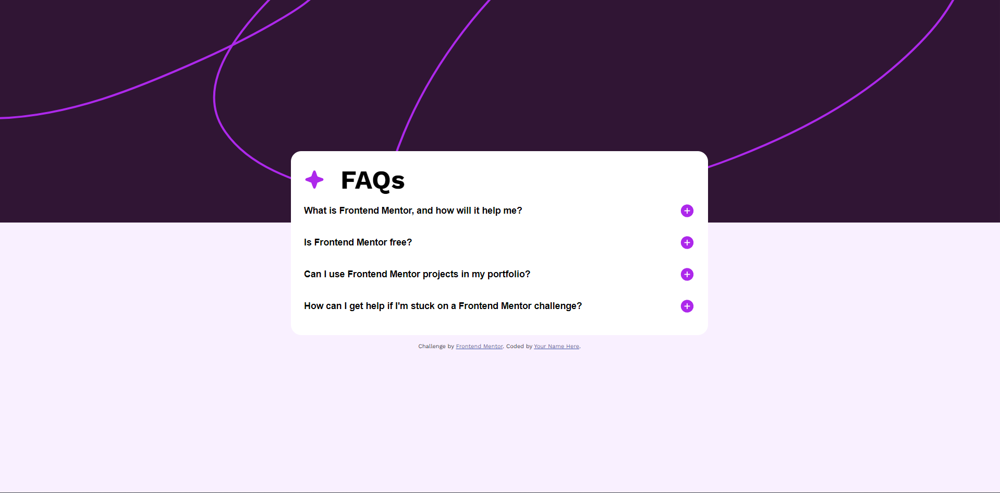

# Frontend Mentor - FAQ accordion solution

This is a solution to the [FAQ accordion challenge on Frontend Mentor](https://www.frontendmentor.io/challenges/faq-accordion-wyfFdeBwBz). Frontend Mentor challenges help you improve your coding skills by building realistic projects. 

## Table of contents

- [Frontend Mentor - FAQ accordion solution](#frontend-mentor---faq-accordion-solution)
  - [Table of contents](#table-of-contents)
  - [Overview](#overview)
    - [The challenge](#the-challenge)
    - [Screenshot](#screenshot)
    - [Links](#links)
  - [My process](#my-process)
    - [Built with](#built-with)
    - [What I learned](#what-i-learned)
    - [Useful resources](#useful-resources)
  - [Author](#author)

## Overview

### The challenge

Users should be able to:

- Hide/Show the answer to a question when the question is clicked
- Navigate the questions and hide/show answers using keyboard navigation alone
- View the optimal layout for the interface depending on their device's screen size
- See hover and focus states for all interactive elements on the page

### Screenshot



### Links

- Solution URL: https://github.com/Atlas-jjs/faq-accordion-desktop
- Live Site URL: https://atlas-jjs.github.io/faq-accordion-desktop/

## My process

### Built with

- Semantic HTML5 markup
- CSS custom properties
- Flexbox
- CSS Grid

### What I learned

- Instead of using a display flex, use a display grid that can control the container and would not make it static.
- I have learned a useful technique such as using the root.

```
:root {
    --white: hsl(0, 0%, 100%);
    --light-pink: hsl(275, 100%, 97%);
    --grayish-purple: hsl(292, 16%, 49%);
    --dark-purple: hsl(292, 42%, 14%);
}
```

### Useful resources

- [Solution](https://www.youtube.com/watch?v=HJuD66J7uCE&ab_channel=edsHTML*/) - This video is the reason why I managed to finish the project.
  I have learned so much about it despite being such a simple project.

## Author

- Website - [Jazreil Jaron](https://atlas-jjs.github.io/faq-accordion-desktop/)
- Frontend Mentor - [@Atlas-jjs](https://www.frontendmentor.io/profile/Atlas-jjs)
